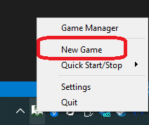
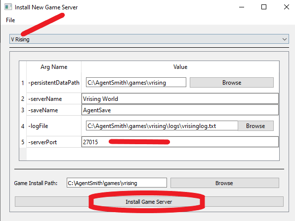
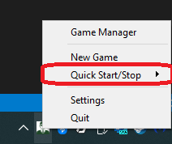
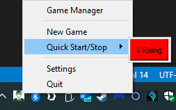
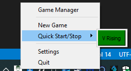
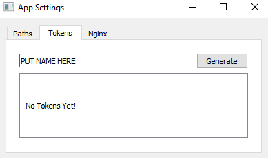
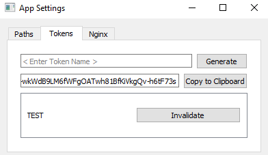

Getting Started
===============

The get started with Agents of the System you will have to both:

1. Make an account on the Architect.
2. Download and install Agent Smith on the PC of your choice.
3. Select a Dedicated Game Server to run, install, and run it.
4. Give control of Agent Smith to The Architect.

Afterwards you can send friend requests, make friend groups, and
then share Agent Smith instances amongst them.

Step 1 - Make an account with the Architect
-------------------------------------------

.. note::
   The Architect is optimized for both a desktop and mobile browser.
   Only A single account is needed for both.

1. Open a browser and navigate to `<https://agentsofthesystem.com/signup>`_
2. Sign up with your email.  If you have already registered, click "Log in here" at the bottom.

Step 2 - Download and install Agent Smith
-----------------------------------------

.. note::
   There is an assumption that the user is doing this for the first time.

.. warning::
   Windows Defender likes to flag agentsmith.exe as malware even though its not.
   Therefore you'll have to direct windows to ignore and allow the executable.

1. Navigate to the Agent Smith `Releases <https://github.com/agentsofthesystem/agent-smith/releases>`_.
2. Releases follow the v[Major].[Minor].[Patch] semantic version.  Be sure that you download
   the most recent version.  The current release or pre-release version will be annotated.
3. Store the executable somewhere, such as your desktop once downloaded.  At this point, windows
   defender may try to delete the file, but you can tell it to allow it. If this happens to you
   then follow `this article <https://pureinfotech.com/allow-blocked-file-app-microsoft-defender-antivirus/>`_
4. Double click or right click and "run".  Agent Smith runs as a system tray application, so it will
   show up in the bottom right of your desktop.  Sometimes windows hides it in the ^ arrow area, but if
   that happens the app can easily be dragged somewhere more accessible.

.. image:: _static/screenshots/getting_started/app_tray.png
  :width: 400
  :align: center
  :alt: Agent Smith in app tray

Step 3 - Run a Dedicate Game Server
-----------------------------------

1. Have a look at Agent Smith's supported `server list <https://github.com/agentsofthesystem/agent-smith?tab=readme-ov-file#supported-games>`_.
2. After one is selected, right click on Agent Smith in the system tray.
3. Click "New Game"

4. In the dropdown, find the game server and select it.
5. The arguments list are preset to defaults, but if anything needs to change do so here.
   For example, with vrising one can change the port number the server runs on.

6. Click Install.  Agent Smith will notify you when the process starts and finishes.
7. After installation completes, right click the appliation tray again except this time
   hover over "Quick Start/Stop". Click it! Red means the server is stopped.
   Green means the server is running.

Step 4 - Give control of Agent Smith to The Architect.
------------------------------------------------------

This step creates a connection between Agent Smith and the Architect.

.. note::
   The Author intends to streamline this process to minimize the amount of effort
   required in the future.

.. warning::
   There are far too many makes/models of Routers to cover each one.  The user
   will need to know how to open a port for Agent Smith.

To begin with, gather the following information:

1. Your Wide Area Network (WAN) IP.  Your ISP assigns this to you and the easiest
   way to get it is by going to `<https://whatismyipaddress.com/>`_ and writing
   it down.  Alternatively, if you have a domain name that points to your IP address
   this is also okay.

2. Agent Smith controls access via Tokens.  Get one by right clicking the tray icon,
   then clicking settings.  On the tokens tab; type in a name and then click "Generate".
   You will get the opportunity to copy the token down. Do so now and keep it in a safe
   place.

.. note::
   There is a button marked "invalidate". Clicking it will permanently invalidate the token. Do
   so if you ever need to remove access to a user with the token.

3. Agent Smith safeguards communication to the Architect via use of a reverse proxy server, Nginx.
   The user must generate a self-signed SSL certificate based on the IP/Domain Name from the first
   step.

   * Back on the settings menu, go to the Nginx tab.
   * Enter the IP/Domain name desired.
   * Enter a port number desired and type that in; something in the range 4000-9000 would work nicely.

    .. warning::
       Try to pick a port number that isn't an even number like 3000. Instead go for something like 2957 where
       all the digits are different.

   * Click "Reset SSL certificate".  Agent Smith will let you know when the process is complete.

    .. image:: _static/screenshots/getting_started/settings_nginx.png
      :width: 400
      :align: center
      :alt: Generate SSL certificate

  * Copy down the SSL Public certificate by clicking "View Public Key CRT File".

    .. image:: _static/screenshots/getting_started/settings_copy_ssl_pubkey.png
      :width: 400
      :align: center
      :alt: View/Copy SSL certificate

  * Lastly, turn Nginx on by checking the box next to "Nginx On/Off".

  4. Log into your Architect account, and navigate to the `Agents Page <https://agentsofthesystem.com/app/system/agents>`_
  5. If there are no agents, click "Add an Agent".

    .. image:: _static/screenshots/getting_started/architect_agents_page_empty.png
      :width: 400
      :align: center
      :alt: Add an Agent

  6. Enter all information acquired from previous steps. However, you can name your agent anything you want!
     Click "Submit" when finished.

    .. image:: _static/screenshots/getting_started/architect_agents_page_agent_form.png
      :width: 400
      :align: center
      :alt: Add agent form.

  7. Now the Agent is connected to The Architect.

    .. image:: _static/screenshots/getting_started/architect_page_agent_add_success.png
      :width: 600
      :align: center
      :alt: Agent successfully added.

    .. note::
       A green badge saying "Alive" will appear if all is well. If not, head over to the :ref:`Troubleshooting Guides`
       section to sort it out.

    .. note::
       To learn more about how to handle/manipulate game servers after this step, head over the section
       about :ref:`Architect Web App (Web & Mobile)`.